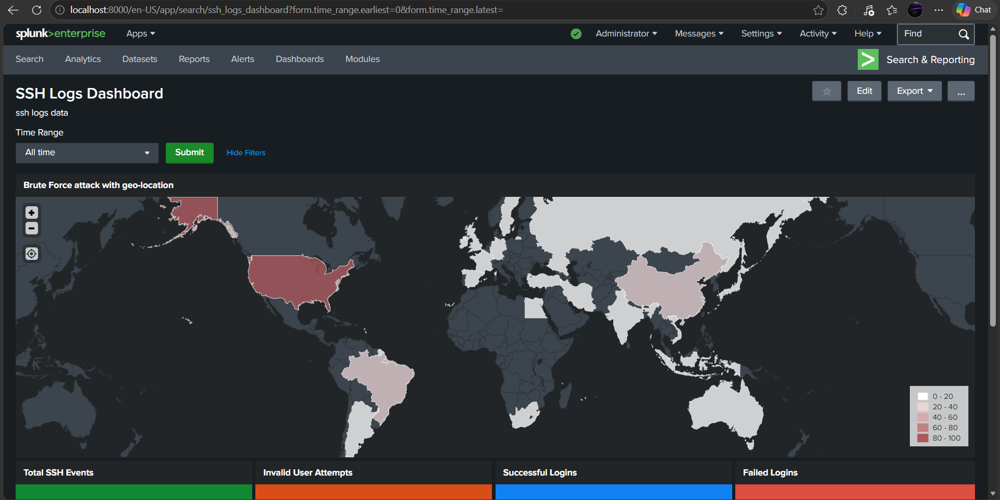

# Splunk Security Analytics: SSH Telemetry Dashboard

## 📊 Overview
This project demonstrates a complete **"Data-to-Dashboard"** pipeline. I engineered a custom Splunk environment to ingest, parse, and visualize **SSH JSON logs**, transforming raw authentication telemetry into a high-visibility security monitoring interface.

## ✨ Key Features
*   **SSH Log Ingestion:** Configured Splunk to correctly index and parse structured `ssh_logs.json` files.
*   **Granular JSON Parsing:** Deconstructed nested JSON data to ensure SSH-specific fields (like `source_ip`, `user`, and `ssh_auth_method`) are fully searchable.
*   **Advanced SPL Logic:** Authored custom **Search Processing Language (SPL)** queries to identify brute-force patterns and anomalous login times.
*   **Visual Storytelling:** Designed a multi-panel dashboard featuring real-time charts for failed vs. successful logins and geographic access patterns.

## 🛠️ Technical Stack
*   **Platform:** Splunk Enterprise
*   **Query Language:** SPL (Search Processing Language)
*   **Data Source:** SSH Logs (JSON)
*   **Logic Framework:** XML

## 📂 Repository Structure
*   `dashboard.xml`: The source code containing the visual and logical architecture of the dashboard.
*   `ssh_logs.json`: A sanitized version of the raw SSH logs used to populate the visualizations.
*   `README.md`: Project documentation and technical overview.

## 🚀 How to Use This Project
1.  **Ingest Data:** Upload the `ssh_logs.json` file into your Splunk instance.
2.  **Apply Logic:** Create a new dashboard in Splunk, toggle to the **Source** view, and paste the contents of `dashboard.xml`.
3.  **Analyze:** Use the visual panels to monitor for SSH authentication anomalies.

## 📸 Dashboard Preview

---

### 💡 Why This Project Matters
Visibility into SSH traffic is critical for defending against credential stuffing and unauthorized access. This project reflects my passion for **Splunk** and my commitment to mastering the data engineering side of security—ensuring defenders have the clarity they need to respond to threats in real-time.
